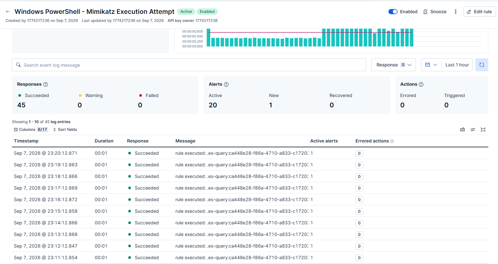

# Detection Engineering Lab: MITRE ATT&CK T1059.001 (PowerShell Mimikatz Execution)

## Overview
Engineered and validated a SIEM detection rule targeting adversary use of PowerShell for credential dumping and malicious script execution (T1059.001), specifically identifying Mimikatz activity.

## Environment Architecture
* **Target Endpoint**: Windows 11 Enterprise (`DESKTOP-COD3V74`)
* **Telemetry Collector**: Elastic Agent (Endpoint Security / Custom Logs)
* **SIEM Platform**: Elastic Cloud SIEM
* **Emulation Tool**: Atomic Red Team (`Invoke-AtomicTest T1059.001 -TestNumbers 1`)

## Detection Logic & Query
* **Rule Type**: Elasticsearch Query
* **Target Index Pattern**: `logs-*`
* **KQL Query**:
  ```kql
  *Mimikatz*


## Threat Emulation & Validation
1. **Emulation**: Executed Atomic Red Team test `T1059.001` via PowerShell as Administrator.
2. **Telemetry Observations**: Identified that Microsoft Defender Antivirus intercepted `Invoke-Mimikatz.ps1` during execution, shipping threat telemetry via endpoint security alerts into `logs-*`.
3. **Validation**: Updated detection query to account for field variations across Windows event channels and confirmed successful trigger (`Active Alerts: 1`) under Rule History.
### Evidence & Alerting


## Technical Key Takeaways
* **Resilient Querying**: Security tools like Defender can block malware before standard PowerShell logs (Event ID 4104) are generated. Searching broadly across all incoming logs (`logs-*`) for threat keywords like `*Mimikatz*` ensures you catch the attack regardless of which log field or security control captures it.
